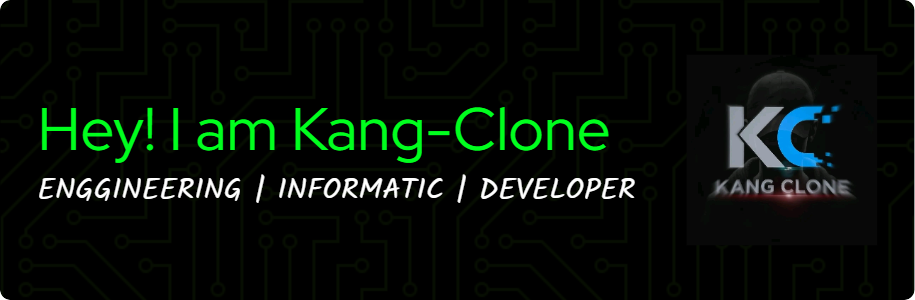

<!-- HEADER HI-TECH FUTURISTIC -->
<p align="center">
  
</p>

<div align="center">
  
</div>
<p align="center">
  
</p>
<p align="center">
  
</p>
<p align="center">
  <a href="https://github.com/kangclone"></a>
  <a href="https://linkedin.com/in/arif-kangclone"></a>
  <a href="https://instagram.com/kang.clone"></a>
  <!-- tambah link lain kalau ada -->
</p>


## 🧠 Tentang Saya

```yaml
👤 Nama           : Kang Clone
🎓 Status         : Mahasiswa Informatika
🖥️ Spesialisasi   : Web Dev, Machine Learning, AI & CV
🛠️ Tools          : Python, PHP, JS, OpenCV, MySQL, Git
🧬 DNA Saya       : 50% Kopi | 25% Tidur | 25% Menghayal | 50% Coding Peke AI
🧠 Moto Hidup     : "Selalu di jalan yang lurus."

[📝 Tinggalkan Pesan untuk Kang Clone](https://kang-clone.github.io/leave-message/)


